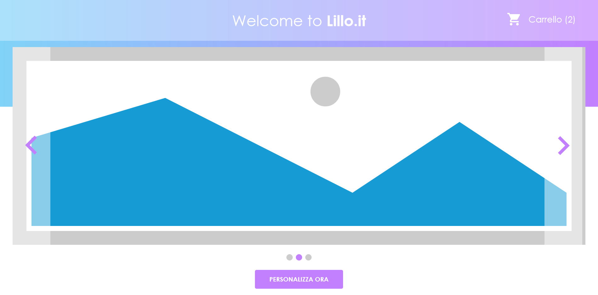

# AngularCommerce

This project was generated with [Angular CLI](https://github.com/angular/angular-cli) version 9.0.5.

# Corso Programmazione web – Angular Avanzato

## Progetto finale

Realizzare un portale web Angular, seguendo i template e i requisiti che verranno condivisi.

Il portale da realizzare rappresenta un piccolo sito di e-commerce che permette di selezionare e personalizzare i propri prodotti che sarà possibile acquistare seguendo il processo di creazione dell&#39;ordine.

### Requisiti

I requisiti del progetto si dividono tra quelli importanti e necessari per la valutazione e altri che possono portare ad alzare il voto finale, anche se non necessari per la presentazione finale del progetto.

#### Requisiti principali per la valutazione

Questi requisiti dovranno essere obbligatoriamente rispettati e saranno valutati in fase d&#39;esame.

Ad ognuno di essi, verrà data una valutazione ed è possibile ottenere la sufficienza generale anche se alcuni di essi risultano non sufficienti (ovviamente la valutazione degli altri requisiti dovrà compensare).

- Seguire i template consegnati nella realizzazione del portale. Su questo punto è presente un margine di libertà:
  - È importante seguire l&#39;usabilità e la navigazione indicate, ma la grafica e i colori possono essere personalizzati
  - Possono essere accettate delle modifiche all&#39;usabilità solo se concordate e giustificate prima con il docente. Ad ogni modo, potrebbero essere penalizzate se comportano una semplicità di sviluppo rispetto a quanto richiesto.
- Corretto funzionamento del portale su almeno due browser diversi (es. su Chrome e Firefox)
- Corretto adattamento della grafica al restringimento della finestra del browser, partendo dalla risoluzione minima di 1024x768, fino alla grandezza massima dello schermo del portatile a disposizione.

- Corretto funzionamento della logica richiesta nelle pagine:
  - Sarà possibile seguire più approcci nella scrittura della logica del portale, per cui è possibile che due approcci diversi siano valutati allo stesso modo.
  - AVVISO: eventuali approcci, benché funzionanti, potrebbero risultare d&#39;altra parte scorretti in termini di buona programmazione e quindi essere in parte penalizzati nella valutazione
  - Portano ad una migliore valutazione di questo requisito:
    - La delegazione della logica ai service piuttosto che ai component.
    - Definire più service, uno per compito specifico (es. login, lista elementi del portale, chiamate http) piuttosto che uno o poco più con dentro tutta la logica del portale.
    - Quando possibile, realizzare più sotto componenti sia per ridurre l&#39;html di un singolo component, che per creare il più possibile, sotto componenti riutilizzabili
    - Per quanto riguarda i punti sopra, cercare di avere questa massima lunghezza in linee di codice (non è obbligatorio, ma rispettarli porterà ad una valutazione bonus):
      - 400 per i file ts e html
      - 75 per i metodi dentro i service e component
- Corretto versionamento del codice, eseguendo più volte i commit per ogni singola parte di sviluppo (magari anche in branch appositi), invece di fare pochi commit con dentro diverse modifiche. Si consiglia di usare più branch per le varie funzionalità.
  - **Importante:** verrà valutato solamente ciò che sarà presente su branch master, per cui ricordarsi di allinearlo con tutte le modifiche fatte.
  - Non eliminare i branch creati, così da permettere durante l&#39;esposizione finale, la loro valutazione
- Utilizzo della libreria json-server per gestire il proprio DB, tramite chiamate http
- Divisione del progetto in moduli, sfruttando al meglio la divisione in core-shared-feature modules
- Utilizzo di NgRx, sfruttando al meglio lo store (action, reducer e selector), gli effects e il router-store. Si consiglia anche di configurare il DevTools sia per lo sviluppo che per facilitare la spiegazione dell&#39;utilizzo della libreria.
- Eseguire almeno un esempio di test con cypress, anche molto semplice
- Creare la documentazione del progetto con compodoc

#### Requisiti bonus

All&#39;interno delle pagine saranno presenti dei contenuti considerabili come bonus, oltre ai quali si aggiunge la creazione completa dei test end to end con cypress.

### Template

I template presentati sono indicativi per quanto riguarda i colori e l&#39;aspetto puramente grafico, ma andranno seguiti per quanto riguarda la navigabilità e usabilità.

Sono presenti all&#39;interno delle pagine alcuni punti che sono bonus e quindi non necessari (in alcuni casi la realizzazione di una pagina è opzionale e quindi un possibile **BONUS** )

#### Login e registrazione

Realizzare le pagine di login e registrazione in linea con il resto del portale, in questo caso non ci sono template da seguire, per cui è a discrezione dello sviluppatore.

#### Home

Una volta effettuato l&#39;accesso non sarà presente un menu, ma direttamente una lista di contenuti dello store che sarò possibile selezionare per la loro personalizzazione e aggiunta al carrello. La lista dei prodotti è a libera discrezione dello sviluppatore, che può decidere che tipi contenuti inserire nello store. Recuperare delle immagini di anteprima da visualizzare nel carosello e più avanti.

In altro a destra è visibile il link per l&#39;accesso al carrello, che deve permettere di visualizzare un&#39;anteprima con il mouse over e effettuare la navigazione al click.

####

#### 

Qui un esempio del carrello aperto con il mouse over

#### Personalizzazione elementi

Dopo aver scelto l&#39;elemento da personalizzare, e cliccato su &quot;PERSONALIZZA ORA&quot;, si accederà alla schermata dove è possibile scegliere le caratteristiche del prodotto da inserire nel carrello.

Il tasto Ripristina, resetta i valori di default.

Il tasto Home, in alto a sinistra, riporta alla home.

Il tasto Aggiungi al carrello, inserisce il prodotto nel carrello e riporta alla home.

**Nota:** L&#39;immagine del prodotto può essere statica e non seguire le personalizzazioni indicate a destra, ma deve corrispondere a quella visualizzata nella home quando si è selezionato il prodotto da visualizzare. Inoltre, le personalizzazioni, possono anche essere leggermente diverse in base alla fantasia dello sviluppatore, basta che non riprendano come numero e formato quelle presenti nell&#39;esempio.

#### Carrello

Una volta cliccato sul carrello, sarà possibile completare l&#39;ordine seguendo gli step presenti nei 3 template qui sotto. Quando visibile il tasto indietro, gestire la navigazione allo step precedente, in cui andranno le informazioni già inserite.

Primo Step: Riepilogo del carrello, con i dettagli dei prodotti aggiunti, totale del prezzo. Gestire la visualizzazione di tanti elementi, con uno scroll contenuto, che visualizza due prodotti per volta o con una paginazione.

I pallini in basso indicano gli step per la realizzazione dell&#39;ordine

Secondo step: Inserimento dell&#39;indirizzo di spedizione, composto da un semplice form. **Bonus:** permettere di salvare e recuperare gli indirizzi.

Terzo step: Riepilogo dei primi due step precedenti e inserimento della carta per pagare. Al click su aggiorna, simulare il pagamento con l&#39;invio di una mail di conferma dove vengono riepilogate le informazioni base. **Bonus** : come per gli indirizzi, permettere il salvataggio e recupero delle carte

